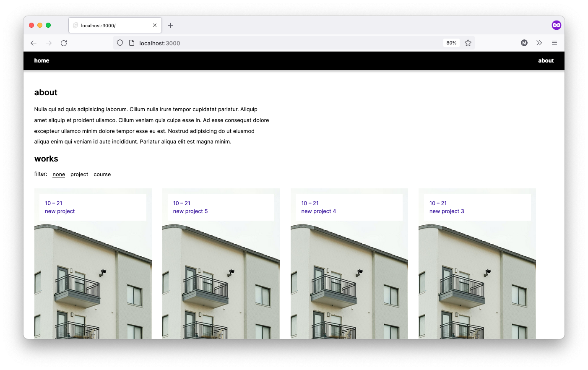

# 👷 werkler 👷



Target of this project-template is to offer a really easy way to create a basic and performant blog / portfolio with the svelte-stack.

All posts are written in Markdown, scaffolding of projects and automatic routing is already set up, so you can just start right off!
Since the articles and images are all organized in this repo, you can just push your changes to the origin (e.g. github).

Hosting is done via netlify which makes hosting things really easy. Netlify will default to rebuilding on every push on your main-branch, which makes updating your site really easy!

## setup

you need to have node and npm installed.

```bash
# install dependencies
npm i
```

## adding content

### automatic scaffolding

you can scaffold a new article by running `npm run create-post YOUR-TITLE`.
this will create a new article file and also a the corresponding asset-folder.
no need to add a date, the script will add this automatically.

#### example

```bash
>> npm run create-post my-new-post

🐥 creating new post: 2110-my-new-post
📦 creating asset folder at: .../static/2110-my-new-post
🥳 done!
```

### manual approach

you can add articles manually within the folder `src/routes/articles` as `.svx` files which allow writing your text in markdown and also adding svelte components inline.

the filename convention is:

`YYMM-articlename.svx`

> parsing happens in `index.ts`-file inside the articles folder. you can do additional parsing and processing there.

currently there are only few things going on when parsing to keep it simple:

- the parser will take the `YYMM` as a date, so you don't need to add it in somewhere else. it is then available as parsed number (e.g. `2110`) for sorting and as formatted string (e.g. `21 – 10`) to display it somewhere.

- the `type` property can be used if you want to filter your projects. the available categories and filters are configured in the file `src/config.ts`.

- resources for articles need to be added into the folder `static/articlename/...`

```
---
layout: post
title: my-cool-project
img: 2110-my-cool-project/cover.jpeg
type: project
---
```

> ## Using VS Code for editing your posts
>
> by default VS Code will not recognize `.svx` files. switching to "Svelte" will autoformat your posts on save and detroy all your nice formatting. I suggest using "MDX" which will at least not destroy your formatting and also **kind of** (lol) highlight your code.

## development

```bash
# start the dev server
npm run dev

# or start the server and open the app in a new browser tab
npm run dev -- --open
```

## styling

styling is done entirely with basic css. no libraries or anything are used which keeps the whole project quite light and manageable. display on mobile is fine regarding the effort put into it (very low).

feel free to add a ui library as you wish!

most of the css is found in `/src/routes/__layout.svelte`. currently there is only one theme-color, that can be configured there.

## building / hosting

werkler comes with an adapter for netlify, so building for netlify just requires linking your github account and committing your changes to the main branch. netlify will then trigger a rebuild and deploy your site automatically as soon as you push your changes to your repo!

```bash
npm run build
```

> You can preview the built app with `npm run preview`, regardless of whether you installed an adapter. This should _not_ be used to serve your app in production.

### optimization

currently, there is no optimization regarding images etc going on. this should be integrated at some point, however doing it manually is also an option. I also suggest using something like [imageoptim](https://imageoptim.com/mac) to reduce filesize.
